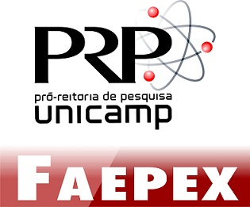

# Workshop: Time Series, Wavelets and High Dimensional Data

At University of Campinas, August 29-30, 2019. Seats are limited, so please contact us at stodad@ime.unicamp.br to let us know which days you will attend.

You can read the invited speakers' presentation abstracts [here](worshop1_abstract.pdf).

## Thursday, August 29, 2019

13h30 Opening 

14h10-15h00 F. Ziegelmann (UFRGS)

&nbsp;&nbsp;&nbsp;&nbsp;&nbsp;&nbsp; Nonparametric Frontier Estimation 

### ST1 - Econometrics

15h00-15h25 M. Fernandes (FGV-SP)

&nbsp;&nbsp;&nbsp;&nbsp;&nbsp;&nbsp; Nonparametric testing of conditional independence using asymmetric kernels 

15h25-15h50 M. Medeiros (PUC-RJ)

&nbsp;&nbsp;&nbsp;&nbsp;&nbsp;&nbsp; BooST: Boosting Smooth Transition Regression Trees for Partial Effect Estimation in Nonlinear Regressions 

15h50-16h15 M. Zevallos (Unicamp)

&nbsp;&nbsp;&nbsp;&nbsp;&nbsp;&nbsp; Estimation of ARFIMA models: a minimum distance approach 

16h20-16h40 Coffee Break 

### ST2 - Time Series

16h40-17h05 P. A. Morettin (USP)

&nbsp;&nbsp;&nbsp;&nbsp;&nbsp;&nbsp; Wavelet Estimation of Copulas for Time Series 

17h05-17h30 L. K. Hotta (Unicamp)

&nbsp;&nbsp;&nbsp;&nbsp;&nbsp;&nbsp; Forecasting Conditional Covariance Matrices in High-Dimensional Time Series: a General Dynamic Factor Approach 

17h30-17h55 C. Chiann (USP)

&nbsp;&nbsp;&nbsp;&nbsp;&nbsp;&nbsp; Estimating the trace-variogram in the ordinary kriging method for functional data using Legendre-Gauss quadrature 

18h00-20h00 Poster Session 

## Friday, August 30, 2019

08h40-09h10 Coffee 

09h10-10h00 Q. Yao (LSE)

&nbsp;&nbsp;&nbsp;&nbsp;&nbsp;&nbsp; Estimation of Subgraph Densities in Noisy Networks 

10h00-10h50 J. Chang (SUFE, China)

&nbsp;&nbsp;&nbsp;&nbsp;&nbsp;&nbsp; A new scope of penalized empirical likelihood with high-dimensional estimating equations 

10h50-11h40 Robert Lund (Clemson)

&nbsp;&nbsp;&nbsp;&nbsp;&nbsp;&nbsp; Multiple Breakpoint Detection: Mixing Documented and Undocumented Changepoints 

11h40-12h30 J. Fan (Princeton)

&nbsp;&nbsp;&nbsp;&nbsp;&nbsp;&nbsp; Noisy matrix completion: Understanding statistical errors of convex relaxation via Nonconvex optimization 

12h30 Closing

  
Supported by:

<!--

-->

 
 
 

