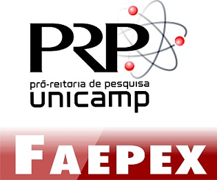

# Workshop: Time Series, Wavelets and High Dimensional Data

At University of Campinas, September ??, 2026. Seats are limited, so please contact us at stodad@ime.unicamp.br to let us know which days you will attend.

You can read the invited speakers' presentation abstracts [here](workshop1_abstract.pdf).

## Thursday, September ??, 2026

13h30 Opening  

14h10-15h00 ??

&nbsp;&nbsp;&nbsp;&nbsp;&nbsp;&nbsp; ??  

### ST1 - ??

15h00-15h25 ??

&nbsp;&nbsp;&nbsp;&nbsp;&nbsp;&nbsp; ??  

15h25-15h50 ??

&nbsp;&nbsp;&nbsp;&nbsp;&nbsp;&nbsp; ??  

15h50-16h15 ??

&nbsp;&nbsp;&nbsp;&nbsp;&nbsp;&nbsp; ??  

16h20-16h40 Coffee Break  

### ST2 - ??

16h40-17h05 ??

&nbsp;&nbsp;&nbsp;&nbsp;&nbsp;&nbsp; ??  

17h05-17h30 ??

&nbsp;&nbsp;&nbsp;&nbsp;&nbsp;&nbsp; ??  

17h30-17h55 ??

&nbsp;&nbsp;&nbsp;&nbsp;&nbsp;&nbsp; ??  

18h00-20h00 Poster Session  

## Friday, September ??, 2026

08h40-09h10 Coffee  

09h10-10h00 ??

&nbsp;&nbsp;&nbsp;&nbsp;&nbsp;&nbsp; Estimation of Subgraph Densities in Noisy Networks  

10h00-10h50 ??

&nbsp;&nbsp;&nbsp;&nbsp;&nbsp;&nbsp; A new scope of penalized empirical likelihood with high-dimensional estimating equations  

10h50-11h40 ??

&nbsp;&nbsp;&nbsp;&nbsp;&nbsp;&nbsp; Multiple Breakpoint Detection: Mixing Documented and Undocumented Changepoints  

11h40-12h30 ??

&nbsp;&nbsp;&nbsp;&nbsp;&nbsp;&nbsp; Noisy matrix completion: Understanding statistical errors of convex relaxation via Nonconvex optimization  

12h30 Closing

  
Supported by:

<!--

 
 
 

-->